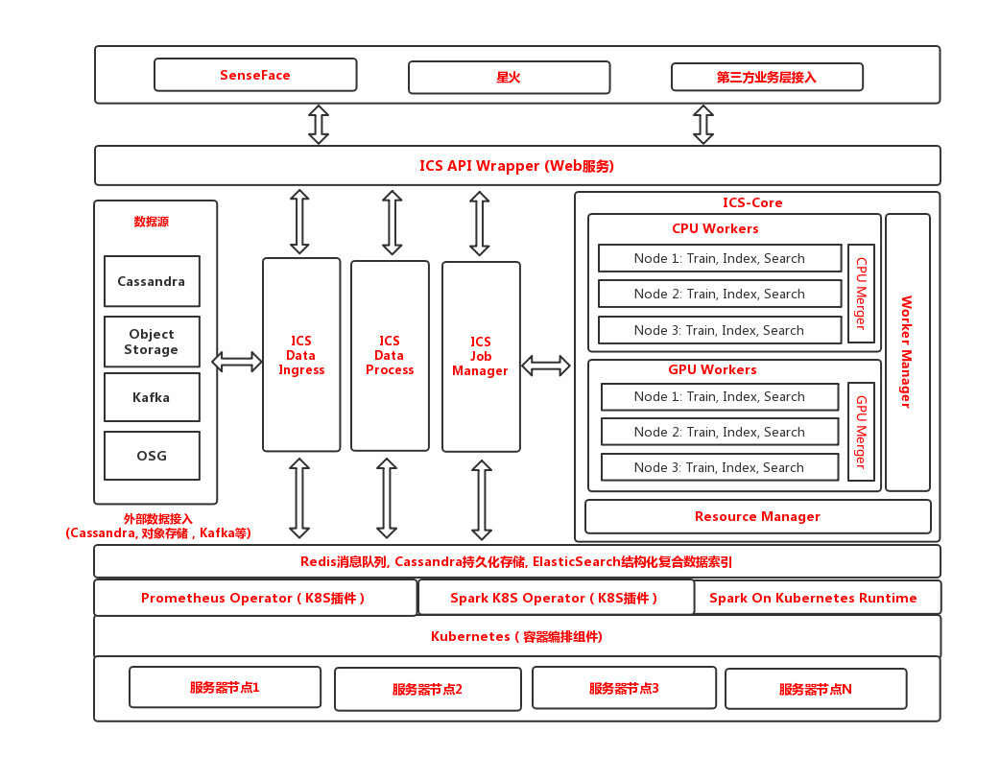
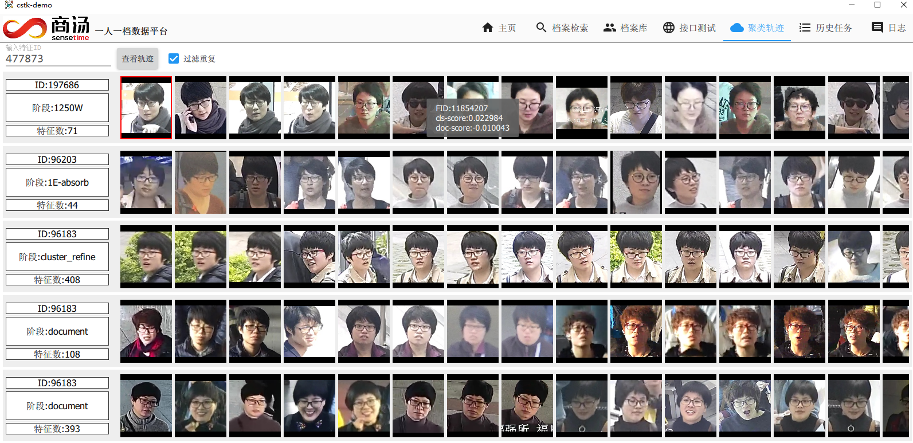
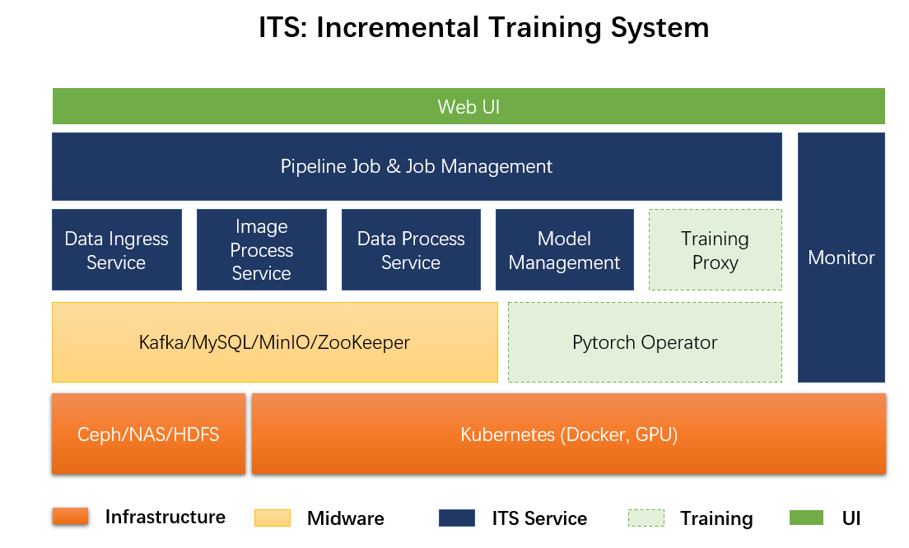
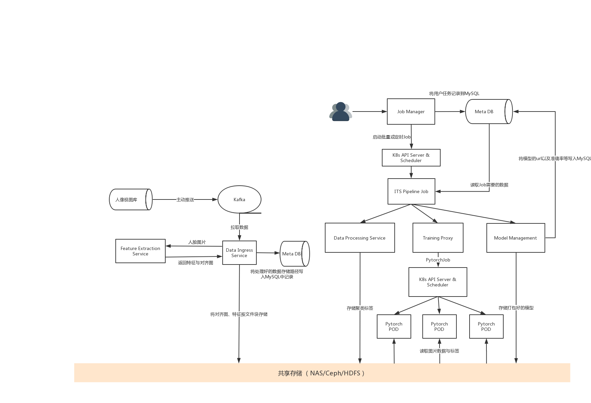

# Selected Projects
Here is the summary of projects that I have done

### 1. A Kubernetes-based High-Dimensional Feature Clustering System

*Company*: Sensetime Research

*Duration*: Feb 2019 - Dec 2019

*Role*: Project Owner

*Team Size:* 5

*Contribution as project owner*: 
  1. Requirement analysis & cross functional team engagement
  2. Project goal definiation for technical & business
  3. Delivery goal definiation and POC customer engagement for technical presales with named-account sales executive
  4. Defined R&D roadmap & timeline

*Contribution as Architect*
  1. Defined development roadmap and system architecture 
  2. Led and worked with other four engineers to iteratively worked on project from 0-1
  3. Translated reserach-side ideas into workable engineering SDKs
  4. Worked on core Kubernetes Spark clustering pipeline and relevant K8S development 

*Buesiness Impact:*
  
  Delivered as the prototype for new version of billion-scale high-dimensional feature clustering system and merged into standard Sensetime platform project: Viper

*System Architecture*

*Clustered Result For Face Features*

### 2. Facial Feature Incremental Training System

*Company*: Sensetime Research

*Duration*: Oct 2018 - Feb 2019

*Role*: Developer

*Contribution as developer*: 
  1. Engaged in system architecture design 
  2. Conducted initial project POC analysis and engine, infra level component design 
  3. One of the first three developers to start inital coding stage

*Buesiness Impact:*
  
  Project incubated into next version of Viper(*De Facto* Sensetime PaaS Platform standard component)

*System Architecture*

*Major Pipeline*

